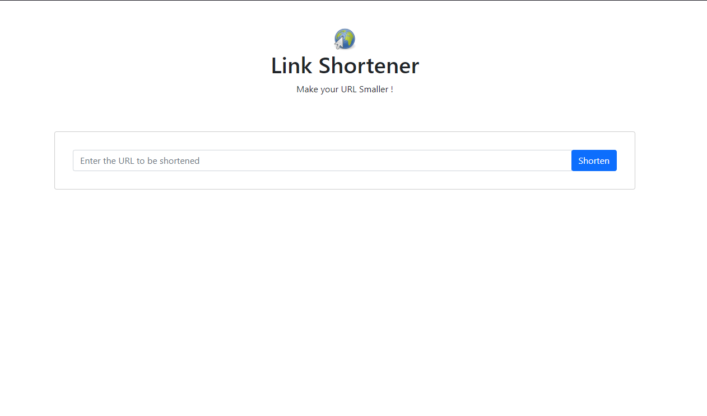

<h1>Link shortener to train Node with express and SQL</h1>

<h2>Instructions:</h2>
Use: " npm run dev " to start the server.  

If you want to create a new database, delete the current database and run: " npm init db " to create a new database

